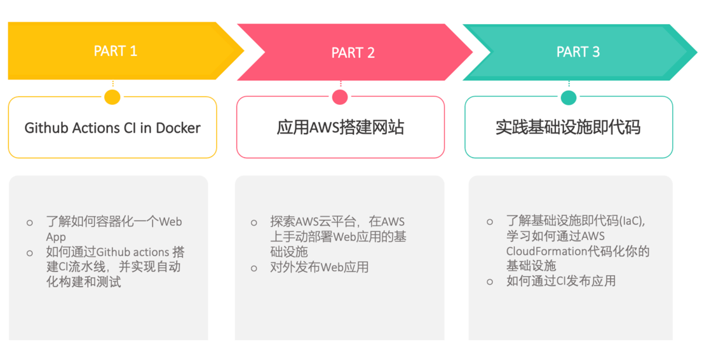

# Devops girls workshop playbook

这是一个Devops girls workshop指南。该指南将引导大家从0开始学习如何将一个应用容器化，并通过CI流水线将该应用部署到AWS云资源上。

## Prerequisite
- Github账号
- Docker
- 支持Node.js的IDE
- git command

## One-time setup
- fork本仓库, 并clone到本地
```shell
git clone https://github.com/devopsgirl2023/hello-ops-girls-demo-<Your name>
```

## Workshop Roadmap


## WorkShop Part1 - GitHub actions CI in Docker

### Step 1: Write a Dockerfile
```dockerfile
FROM node:19-slim@sha256:f58f1fcf5c9ff9e3752993edb4ed6dbd35697124c85a43f3b97aa054500b0534
WORKDIR /app
RUN apt-get update && apt-get install python3 -y
COPY yarn.lock package.json /app/
RUN yarn install
COPY . /app/
RUN npx tsc
EXPOSE 8000
CMD ["yarn", "start"]
```

### Step 2: Build and run your docker from local
```shell
# Build your docker image
$ docker build -t ops-girls-demo:dev .
# Run a docker container
$ docker run --rm -p 8000:8000 ops-girls-demo:dev
$ docker ps
# 浏览器访问：http://localhost:8000/public/
```

### Step 3: Trigger a CI workflow 
提交并push你的Dockerfile。你应该会在你的repo->Actions里看到一条被触发的流水线。
```shell
git add .
git commit -m "Added somthing new" 
git push origin main
```
### Step 4: Create a build and test job in the workflow 
完善CI流水线，添加build和test job。在CI中实现构建、推送镜像，并成功运行单元测试。build步骤参考：
```yaml
jobs:
  build:
    runs-on: ubuntu-latest
    steps:
      - uses: actions/checkout@v3
      - id: aws-auth
        uses: "./.github/actions/aws-auth"
      - name: Build and push dev image to ECR
        env:
          REGISTRY: ${{ steps.aws-auth.outputs.registry }}
          REPOSITORY: devopsgirl2023/hello-ops-girl
          IMAGE_TAG: ${{ github.sha }}
        run: |
          docker build -t $REGISTRY/$REPOSITORY:$IMAGE_TAG .
          docker push $REGISTRY/$REPOSITORY:$IMAGE_TAG
```

## WorkShop Part2 - 应用AWS搭建网站
### step1: 手动创建 ec2 instance
### step2: 更新 ec2 的 iam role
### step3: 登陆 ec2
`ssh -i <pem> ec2-user@<public-ip>`
### step4: 安装 docker
```
1. sudo yum update -y
2. sudo amazon-linux-extras install docker -y
3. sudo usermod -aG docker ec2-user
4. sudo systemctl start docker
5. sudo systemctl enable docker
6. docker info
7. re-connect ec2
8. docker info
```
### step5: 登陆 ECR
`aws ecr get-login-password --region {{ aws_region }} | docker login --username AWS --password-stdin {{ aws_account }}.dkr.ecr.{{ aws_region }}.amazonaws.com"`
### step6: 拉取 docker image
`aws ecr get-login-password --region {{ aws_region }} | docker login --username AWS --password-stdin {{ aws_account }}.dkr.ecr.{{ aws_region }}.amazonaws.com"`
### step7: 启动 docker
`docker run --name hello-ops-girl-app -d -p 8000:8000 {{ aws_account }}.dkr.ecr.{{ aws_region }}.amazonaws.com/devopsgirl2023/{{ ecr_repo }}:latest`
### step8: 安装 nginx
### step9: 启动 nginx
### step10: 更新 nginx 配置文件

## WorkShop Part3 - 实践基础设施即代码
